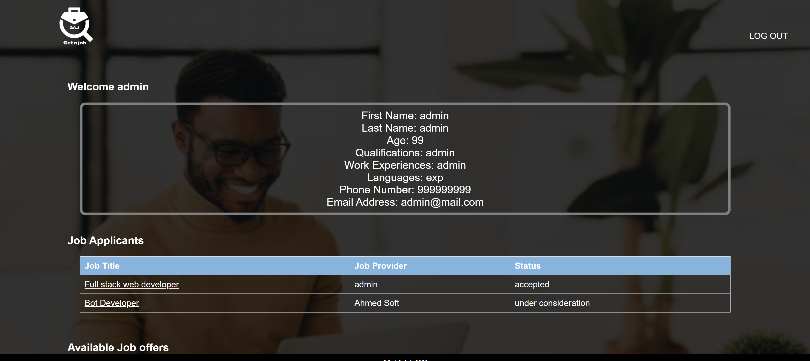

# jobWeb

  

## Table of Contents

- [Description](#Description)
- [installation](#installation)
- [Screenshots](#Screenshots)

 ## Description 
 A job website  that serves both job seekers and job providers

## installation 
 
 Feel free to explore the app and see these features in action! 
  
 by downloading the files and try it.

## Screenshots

Here are some screenshots of the app in action:

        

## languages used 

        

 
 
